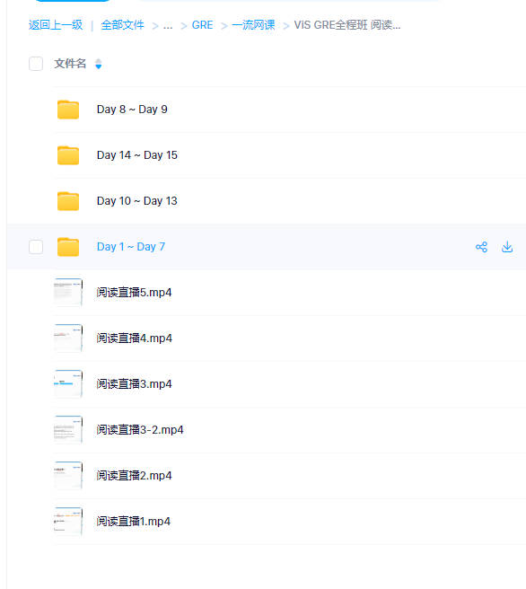

# GER PLAN

+ 背单词

  + 方法 直接使用GRE3000 APP

+ 阅读 

  + 刷完 ViS GRE全程班 阅读课

  + 真题： GRE阅读鸡精260篇.pdf（答案解析通过PDF内关注公众号的方式获取）

    

+ 填空  数学 写作

  + 刷完除微臣的所有2月3日GRE冲325课程（阅读部分除外）
  + 真题
    + 填空
      + GRE填空机经1300题
      
      + （答案解析通过PDF内关注公众号的方式获取）
      
        
    + 数学
      + 巍哥GRE数学170难题3.0
    + 写作
      + 随便按照方法练习一篇

## 背单词

### 方法： 直接使用GRE3000 APP

## 阅读

### 课程：刷完 ViS GRE全程班 阅读课

### 真题 ：GRE阅读鸡精260篇.pdf（答案解析通过PDF内关注公众号的方式获取）

## 填空 写作 数学

### 课程：刷完除微臣的所有2月3日GRE冲325课程（阅读部分除外）

### 真题

#### 填空
##### GRE填空机经1300题（答案解析通过PDF内关注公众号的方式获取）
#### 数学
##### 巍哥GRE数学170难题3.0
#### 写作
##### 随便按照方法练习一篇
