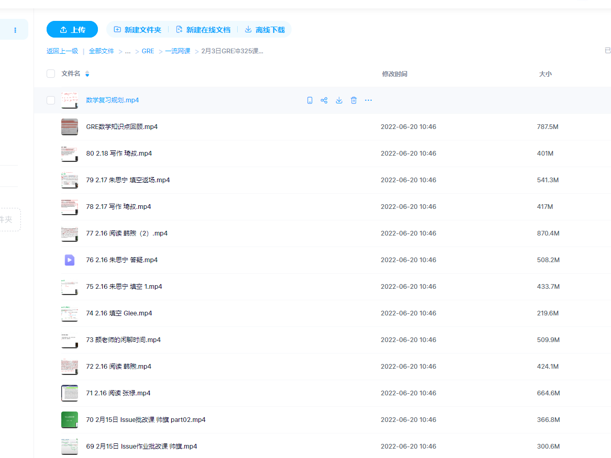

# GER PLAN

以下方法按照顺序从上到下进行，根据泽同学经验整理

+ 背单词

  + 方法 直接使用GRE3000 APP

+ 阅读 

  + 先刷完 ViS GRE全程班 阅读课

  + 再刷完所有真题： GRE阅读鸡精260篇.pdf

    

+ 填空  数学 写作

  + 先刷完除微臣的所有2月3日GRE冲325课程（阅读部分除外）
  + 再刷完以下所有真题
    + 填空
      + GRE填空机经1300题 
      
    + 数学
      + 巍哥GRE数学170难题3.0
    + 写作
      + 随便微臣写作课的方法，随便练习一篇

## 背单词

### 方法： 直接使用GRE3000 APP

## 阅读

### 课程：刷完 ViS GRE全程班 阅读课

### 真题 ：GRE阅读鸡精260篇.pdf

## 填空 写作 数学

### 课程：刷完除微臣的所有2月3日GRE冲325课程（阅读部分除外）

### 真题

#### 填空
##### GRE填空机经1300题
#### 数学
##### 巍哥GRE数学170难题3.0
#### 写作
##### 随便按照方法练习一篇 

+ 独立写作练一篇

+ 综合写作四个类型的开头结尾自己准备一个模版就行 (练都不用练)

+ 他写作课后面有两节课现场给你写作文,那个东西收获贼大，其他的我感觉就是中规中矩

  
